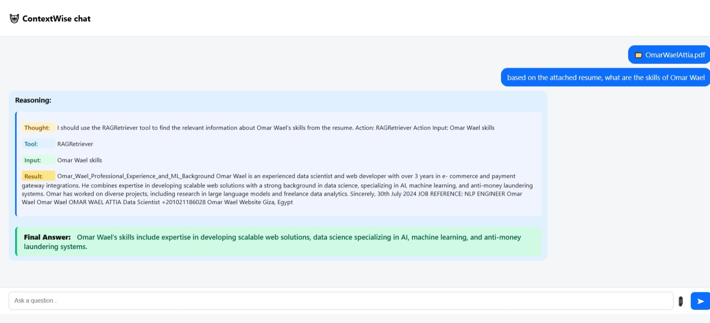

# 🤖 ContextWise App with RAG + Agent Tools

This project demonstrates a full-stack AI chat interface that supports document upload and contextual question answering using **Retrieval-Augmented Generation (RAG)** and **LangChain agents**. Responses are streamed token-by-token for a real-time ChatGPT-like experience.

---
## Screenshot


---

## Demo

## 🎥 Demo

[![Watch Demo on YouTube]](https://youtu.be/0eF8omSNLSU))


## 🚀 Features

- 📄 Upload documents and extract relevant knowledge  
- 🧠 Ask questions and receive detailed answers  
- 🧭 Displays agent reasoning (Thought → Tool → Input → Result)  
- 🔌 Supports multiple tools (e.g., RAGRetriever, Calculator)  
- 🔄 Real-time streamed response from OpenAI GPT  
- 🖥️ Frontend built in React, Backend in FastAPI  

---

## ⚙️ Setup Instructions

### 🔹 1. Clone the Repository

```bash
git clone https://github.com/your-username/ai-chat-rag-app.git
cd ai-chat-rag-app
```

---

### 🔹 2. Backend Setup (FastAPI)

> **Requirements:** Python 3.10+, pip, virtualenv

```bash
cd backend
python -m venv rag_venv
source rag_venv/bin/activate  # On Windows: rag_venv\Scripts\activate
pip install -r requirements.txt
```

Create a `.env` file or export your API key directly:

```env
OPENAI_API_KEY=your-openai-api-key
```

Then run the backend server:

```bash
uvicorn app:app --reload --port 8000
```

---

### 🔹 3. Frontend Setup (React)

> **Requirements:** Node.js v18+

```bash
cd frontend
npm install
npm start
```

The frontend runs at `http://localhost:3000` and communicates with the backend at `http://localhost:8000`.

---

## 💡 How to Use the App

1. Click the 📎 icon to upload a `.txt` or `.pdf` file  
2. Wait for a toast confirmation: `Upload complete (X chunks saved)`  
3. Type your question and click ➤ (or press Enter)  
4. Watch the AI stream its thought process and final answer  

---

## ✅ Testing Document Upload + Chat

To test the end-to-end flow:

1. **Upload** a structured resume, report, or document  
2. **Ask** something like:

   ```
   What are Omar Wael’s skills mentioned in the resume?
   ```

3. The app will return:
   - 📘 Final Answer  
   - 🔍 Step-by-step reasoning (Thought → Tool → Input → Result)

---

## 🧠 How RAG + Agent Works

This app integrates:

### 1. `RAGRetriever` Tool  
- Uses LangChain + ChromaDB to chunk and store document data  
- User queries are embedded and matched against stored context  

### 2. LangChain Agent (`ReAct`-style)  
- Uses `ChatOpenAI` with `ZERO_SHOT_REACT_DESCRIPTION` agent type  
- Dynamically selects tools like:
  - `RAGRetriever` (for context lookup)
  - `CalculatorTool` (for mathematical operations)

### 3. OpenAI Streaming  
- The backend streams token-by-token responses  
- The frontend updates the chat bubble in real time

---

## 📁 Project Structure

```
ai-chat-rag-app/
├── backend/
│   ├── app.py                  # FastAPI application entry
│   ├── agent.py                # LangChain agent setup logic
│   ├── utils/
│   │   ├── config.py
│   │   ├── document_loader.py
│   │   ├── vector_store.py
│   │   └── streaming_callback.py
│   └── tools/
│       ├── calculator_tool.py
│       └── rag_tool.py
│
├── frontend/
│   ├── App.js                  # React main component
│   ├── App.css                 # Styling for chat and layout
│   ├── index.js
│   └── ...
```

---

## 🌟 Future Enhancements

- ✅ **Real-time Streaming Responses**  
  Agent responses are streamed token-by-token for faster feedback and improved UX.

- 🔄 **Multi-Document Chat Context**  
  Allow uploading multiple files and query across all uploaded content within the same session.

- 🧠 **Chat Memory + History Persistence**  
  Maintain contextual memory across multiple turns and persist chats per user or session.

---

## 📝 License

This project is open-sourced under the **MIT License**.

---

## 🙋‍♂️ Questions or Feedback?

Feel free to open an issue or contact [Omar Wael](mailto:omarwaelattia@aucegypt.edu) if you have any suggestions or inquiries.

---
```
